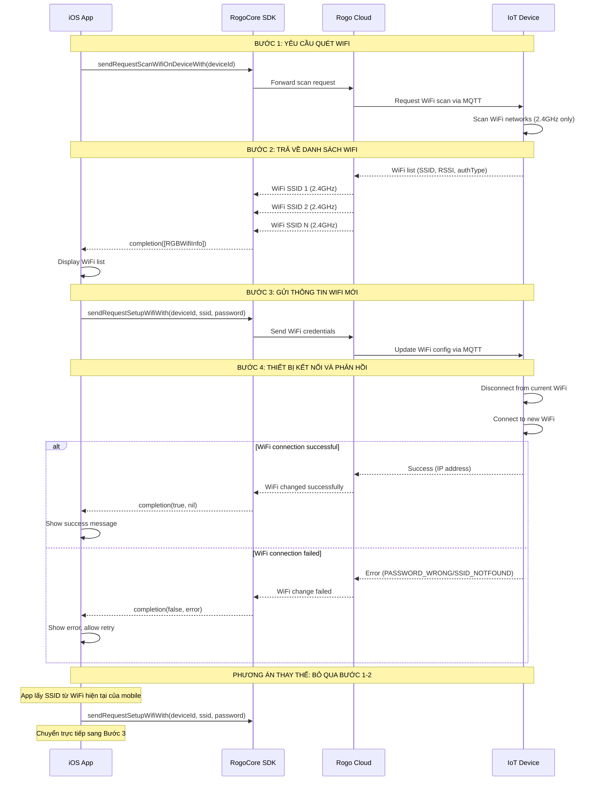
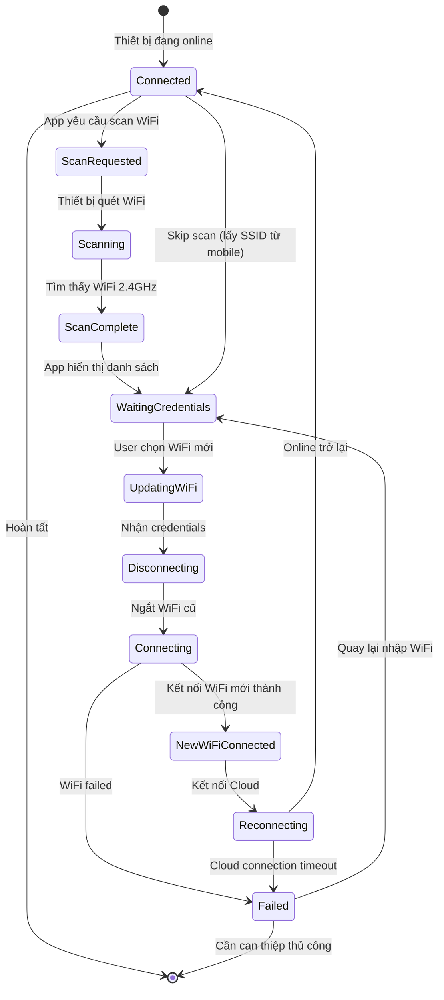
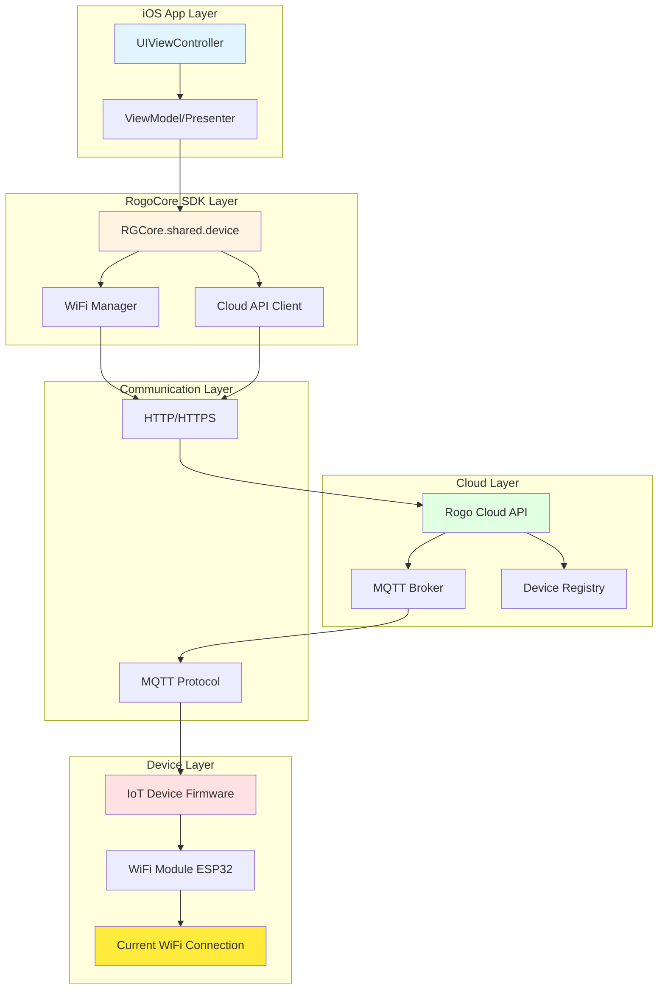

# Rogo Smart SDK - iOS

## Hướng dẫn Flow thay đổi WiFi cho thiết bị

Tài liệu này mô tả quy trình chi tiết để thay đổi kết nối WiFi cho thiết bị đã được thêm vào hệ thống thông qua Rogo Mobile SDK.

## Lưu ý trước khi thực hiện
- Đảm bảo thiết bị đã được thêm vào tài khoản
- Thiết bị phải đang online và kết nối với mạng WiFi hiện tại
- Mobile app phải có kết nối internet
- Thiết bị chỉ hỗ trợ WiFi 2.4GHz (không hỗ trợ 5GHz)

## Sơ đồ tổng quan

### Sơ đồ luồng giao tiếp



### Sơ đồ trạng thái thiết bị



### Sơ đồ kiến trúc giao tiếp



## Quy trình thay đổi WiFi

### Bước 1: Yêu cầu quét WiFi từ thiết bị (Request WiFi Scan)
Gửi yêu cầu đến thiết bị để quét các mạng WiFi 2.4GHz khả dụng xung quanh.

```swift
RGCore.shared.device.sendRequestScanWifiOnDeviceWith(
    deviceId: String,
    timeOut: Int?,
    completion: RGBCompletionObject<[RGBWifiInfo]?>?
)
```

#### Đối số
- `deviceId`: `String` - UUID của thiết bị Wile cần đổi kết nối WiFi
- `timeOut`: `Int?` - Thời gian timeout (giây). Khuyến nghị: 10-15 giây. Truyền `nil` để dùng timeout mặc định
- `completion`: `RGBCompletionObject<[RGBWifiInfo]?>?` - Closure được gọi khi nhận được danh sách WiFi hoặc có lỗi

#### Completion Handler
```swift
RGCore.shared.device.sendRequestScanWifiOnDeviceWith(
    deviceId: device.uuid ?? "",
    timeOut: 15,
    completion: { [weak self] response, error in
        guard let self = self else { return }

        if let error = error {
            // Lỗi khi quét WiFi
            DispatchQueue.main.async {
                self.showError("Lỗi quét WiFi: \(error.localizedDescription)")
            }
            return
        }

        guard let wifiList = response else {
            // Timeout hoặc không nhận được response
            DispatchQueue.main.async {
                self.showError("Không nhận được danh sách WiFi từ thiết bị")
            }
            return
        }

        // Nhận được danh sách WiFi
        DispatchQueue.main.async {
            self.handleWifiListReceived(wifiList: wifiList)
        }
    }
)
```

#### Lưu ý quan trọng
- **Thiết bị phải online**: Đảm bảo `device.online == true` trước khi gọi API
- **Chỉ WiFi 2.4GHz**: Thiết bị chỉ quét và hiển thị mạng WiFi 2.4GHz, không hỗ trợ 5GHz
- **Timeout hợp lý**: Quá trình quét WiFi có thể mất 10-15 giây, nên set timeout phù hợp

### Bước 2: Thiết bị trả về danh sách WiFi SSID (Device Returns WiFi List)
Thiết bị quét và trả về danh sách các mạng WiFi 2.4GHz khả dụng.

#### Xử lý danh sách WiFi
```swift
func handleWifiListReceived(wifiList: [RGBWifiInfo]) {
    // Lưu danh sách WiFi
    self.wifiList = wifiList

    // Lọc ra các SSID không nil
    let ssidList = wifiList.filter { $0.ssid != nil }.map { $0.ssid! }

    // Xử lý từng WiFi
    for wifiInfo in wifiList {
        guard let ssid = wifiInfo.ssid else { continue }

        print("SSID: \(ssid)")
        print("RSSI: \(wifiInfo.rssi) dBm")
        print("Auth Type: \(wifiInfo.authType)")

        // Kiểm tra loại bảo mật
        switch wifiInfo.authType {
        case .WIFI_AUTH_OPEN:
            print("-> WiFi không có mật khẩu")
        case .WIFI_AUTH_WPA2_PSK, .WIFI_AUTH_WPA_WPA2_PSK:
            print("-> WiFi có bảo mật WPA2 (khuyến nghị)")
        case .WIFI_AUTH_WEP:
            print("-> WiFi có bảo mật WEP (không an toàn)")
        default:
            print("-> WiFi có bảo mật")
        }
    }

    // Sắp xếp theo cường độ tín hiệu (mạnh nhất trên cùng)
    let sortedWifiList = wifiList.sorted { $0.rssi > $1.rssi }

    // Hiển thị UI cho user chọn
    self.showWifiSelectionScreen(wifiList: sortedWifiList)
}
```

#### RGBWifiInfo Structure
```swift
class RGBWifiInfo {
    var ssid: String?           // Tên mạng WiFi
    var rssi: Int               // Cường độ tín hiệu (-100 đến 0 dBm)
    var authType: RGBWifiAuthType  // Loại bảo mật
}

// Các loại bảo mật
enum RGBWifiAuthType: Int {
    case WIFI_AUTH_OPEN = 0           // Không mật khẩu
    case WIFI_AUTH_WEP = 1            // WEP (không khuyến nghị - không an toàn)
    case WIFI_AUTH_WPA_PSK = 2        // WPA
    case WIFI_AUTH_WPA2_PSK = 3       // WPA2 (khuyến nghị)
    case WIFI_AUTH_WPA_WPA2_PSK = 4   // WPA/WPA2 hỗn hợp
    case WIFI_AUTH_WPA2_ENTERPRISE = 5 // WPA2 Enterprise (không hỗ trợ)
    case WIFI_AUTH_WPA3_PSK = 6       // WPA3
    case WIFI_AUTH_WPA2_WPA3_PSK = 7  // WPA2/WPA3 hỗn hợp
    case WIFI_AUTH_WAPI_PSK = 8       // WAPI (Trung Quốc)
    case WIFI_AUTH_MAX = 9            // Max value
}
```

#### Lọc và validate WiFi list
```swift
func filterValidWifiNetworks(_ wifiList: [RGBWifiInfo]) -> [RGBWifiInfo] {
    return wifiList.filter { wifi in
        // Lọc WiFi có SSID
        guard let ssid = wifi.ssid, !ssid.isEmpty else {
            return false
        }

        // Lọc WiFi có tín hiệu đủ mạnh (> -90 dBm)
        guard wifi.rssi > -90 else {
            return false
        }

        // Loại bỏ WiFi Enterprise (không hỗ trợ)
        guard wifi.authType != .WIFI_AUTH_WPA2_ENTERPRISE else {
            return false
        }

        return true
    }
}
```

### Bước 3: Gửi thông tin WiFi mới (Send New WiFi Credentials)
Gửi thông tin SSID và mật khẩu của mạng WiFi mới đến thiết bị.

```swift
RGCore.shared.device.sendRequestSetupWifiWith(
    deviceId: String,
    wifiSsid: String,
    wifiPassword: String,
    timeOut: Int?,
    completion: (_ response: Bool?, Error?) -> Void
)
```

#### Đối số
- `deviceId`: `String` - UUID của thiết bị Wile muốn đổi kết nối WiFi
- `wifiSsid`: `String` - Tên mạng WiFi mới (SSID). Lấy từ danh sách scan ở Bước 2 hoặc từ WiFi hiện tại của mobile
- `wifiPassword`: `String` - Mật khẩu WiFi mới. Truyền `""` (chuỗi rỗng) cho Open WiFi
- `timeOut`: `Int?` - Thời gian timeout (giây). Khuyến nghị: 30-60 giây vì thiết bị cần thời gian để kết nối WiFi mới
- `completion`: `(_ response: Bool?, Error?) -> Void` - Closure được gọi khi thiết bị phản hồi kết quả

#### Completion Handler
```swift
RGCore.shared.device.sendRequestSetupWifiWith(
    deviceId: device.uuid ?? "",
    wifiSsid: selectedSSID,
    wifiPassword: password,
    timeOut: 60,
    completion: { [weak self] response, error in
        guard let self = self else { return }

        DispatchQueue.main.async {
            self.hideLoadingIndicator()

            if let error = error {
                // Lỗi trong quá trình gửi request hoặc timeout
                self.handleWifiChangeError(error: error)
                return
            }

            if let success = response, success {
                // Thay đổi WiFi thành công
                self.showSuccessAlert("Đã thay đổi WiFi thành công!") {
                    // Cập nhật trạng thái thiết bị
                    self.refreshDeviceStatus()
                }
            } else {
                // Thay đổi WiFi thất bại
                self.showErrorAlert("Không thể thay đổi WiFi. Vui lòng thử lại.") {
                    // Cho phép thử lại
                    self.showWifiSelectionScreen(wifiList: self.wifiList)
                }
            }
        }
    }
)
```

#### Ví dụ UI Implementation
```swift
@IBAction func btnChangeWifiTapped(_ sender: UIButton) {
    guard let device = self.currentDevice else {
        showAlert("Không tìm thấy thông tin thiết bị")
        return
    }

    // Kiểm tra thiết bị online
    guard device.online else {
        showAlert("Thiết bị đang offline. Vui lòng kiểm tra kết nối.")
        return
    }

    guard let selectedWifi = self.selectedWifi else {
        showAlert("Vui lòng chọn mạng WiFi")
        return
    }

    let ssid = selectedWifi.ssid ?? ""
    let password = txtPassword.text ?? ""

    // Kiểm tra WiFi có cần password không
    if selectedWifi.authType == .WIFI_AUTH_OPEN {
        // WiFi không có mật khẩu
        changeDeviceWifi(ssid: ssid, password: "")
    } else {
        // WiFi có mật khẩu
        guard !password.isEmpty else {
            showAlert("Vui lòng nhập mật khẩu WiFi")
            return
        }

        // Validate độ dài password
        guard password.count >= 8 else {
            showAlert("Mật khẩu WiFi phải có ít nhất 8 ký tự")
            return
        }

        changeDeviceWifi(ssid: ssid, password: password)
    }
}

func changeDeviceWifi(ssid: String, password: String) {
    showLoadingIndicator("Đang thay đổi WiFi...\nThiết bị sẽ mất kết nối trong vài giây.")

    RGCore.shared.device.sendRequestSetupWifiWith(
        deviceId: currentDevice?.uuid ?? "",
        wifiSsid: ssid,
        wifiPassword: password,
        timeOut: 60,
        completion: { [weak self] response, error in
            // Xử lý response
        }
    )
}
```

#### Phương án thay thế: Lấy SSID từ Mobile
```swift
import SystemConfiguration.CaptiveNetwork

func getCurrentWifiSSID() -> String? {
    guard let interfaces = CNCopySupportedInterfaces() as? [String] else {
        return nil
    }

    for interface in interfaces {
        guard let interfaceInfo = CNCopyCurrentNetworkInfo(interface as CFString) as? [String: Any] else {
            continue
        }

        return interfaceInfo[kCNNetworkInfoKeySSID as String] as? String
    }

    return nil
}

// Sử dụng
func useCurrentMobileWifi() {
    guard let currentSSID = getCurrentWifiSSID() else {
        showAlert("Không thể lấy thông tin WiFi từ thiết bị. Vui lòng cấp quyền Location.")
        return
    }

    // Yêu cầu user nhập password
    showPasswordInput(for: currentSSID) { [weak self] password in
        // Skip Bước 1 & 2, gọi trực tiếp sendRequestSetupWifiWith
        self?.changeDeviceWifi(ssid: currentSSID, password: password)
    }
}
```

**Lưu ý về quyền:**
- Để lấy SSID từ mobile, cần thêm vào `Info.plist`:
```xml
<key>NSLocationWhenInUseUsageDescription</key>
<string>App cần quyền vị trí để lấy thông tin WiFi</string>
```

### Bước 4: Thiết bị kết nối và phản hồi (Device Connects & Responds)
Thiết bị nhận thông tin WiFi mới, ngắt kết nối WiFi cũ, kết nối WiFi mới và gửi phản hồi về kết quả.

#### Quá trình diễn ra trên thiết bị
```
1. Nhận WiFi credentials từ Cloud (qua MQTT)
2. Lưu thông tin WiFi mới vào bộ nhớ
3. Ngắt kết nối WiFi hiện tại
4. Kết nối vào WiFi mới
   ├─ Thành công → Lấy IP address → Kết nối lại Cloud → Gửi success
   └─ Thất bại → Thử lại 3 lần → Gửi error code
```

#### Xử lý kết quả
```swift
func handleWifiChangeResult(response: Bool?, error: Error?) {
    if let error = error {
        // Lỗi network, timeout, hoặc lỗi từ thiết bị
        let nsError = error as NSError

        switch nsError.code {
        case -1001: // Timeout
            showErrorAlert("Timeout: Thiết bị không phản hồi. Có thể đang kết nối WiFi mới.") {
                // Cho phép kiểm tra trạng thái sau
                self.showCheckDeviceStatusOption()
            }

        case 1003: // PASSWORD_WRONG
            showErrorAlert("Mật khẩu WiFi không đúng. Vui lòng kiểm tra lại.") {
                // Cho phép nhập lại password
                self.retryWithNewPassword()
            }

        case 1004: // SSID_NOTFOUND
            showErrorAlert("Không tìm thấy WiFi. Đảm bảo router WiFi đang hoạt động.") {
                // Quay lại chọn WiFi khác
                self.showWifiSelectionScreen(wifiList: self.wifiList)
            }

        default:
            showErrorAlert("Lỗi: \(error.localizedDescription)")
        }
        return
    }

    if let success = response, success {
        // Thành công
        showSuccessMessage()
    } else {
        // Thất bại nhưng không có error cụ thể
        showGenericFailureMessage()
    }
}
```

#### Kiểm tra trạng thái thiết bị sau khi đổi WiFi
```swift
func checkDeviceStatusAfterWifiChange() {
    // Đợi 10 giây để thiết bị kết nối WiFi mới
    DispatchQueue.main.asyncAfter(deadline: .now() + 10) { [weak self] in
        guard let self = self else { return }

        // Refresh device từ server
        self.refreshDeviceFromServer { device in
            if device.online {
                // Thiết bị đã online trở lại
                self.showSuccessAlert("Thiết bị đã kết nối WiFi mới thành công!")
            } else {
                // Thiết bị vẫn offline
                self.showWarningAlert("Thiết bị chưa online. Vui lòng chờ hoặc kiểm tra lại.")
            }
        }
    }
}
```

## Phương án thay thế: Bỏ qua quét WiFi

Như đã nêu, developer có thể bỏ qua Bước 1 & 2 (quét WiFi từ thiết bị) và sử dụng thông tin WiFi từ mobile để tiết kiệm thời gian.

### Ưu điểm
- **Nhanh hơn**: Tiết kiệm 10-15 giây thời gian quét WiFi
- **Đơn giản hơn**: Ít bước xử lý, code gọn hơn
- **Tiện lợi**: User không cần chọn WiFi, tự động dùng WiFi hiện tại của mobile

### Nhược điểm
- **Cần quyền Location**: iOS yêu cầu quyền Location để lấy SSID
- **Không linh hoạt**: User không thể chọn WiFi khác
- **Risk cao hơn**: Không biết thiết bị có "nhìn thấy" WiFi đó không

### Code example
```swift
import SystemConfiguration.CaptiveNetwork

class ChangeWifiQuickViewController: UIViewController {

    var currentDevice: RGBDevice?

    // MARK: - Quick Change WiFi (Skip scan)
    func quickChangeWifi() {
        // Kiểm tra thiết bị online
        guard let device = currentDevice, device.online else {
            showAlert("Thiết bị đang offline")
            return
        }

        // Lấy SSID từ mobile
        guard let currentSSID = getCurrentWifiSSID() else {
            showAlert("Không thể lấy thông tin WiFi. Vui lòng cấp quyền Location trong Settings.")
            return
        }

        // Hiển thị dialog nhập password
        showPasswordInput(ssid: currentSSID) { [weak self] password in
            guard let self = self else { return }

            // Gọi trực tiếp API thay đổi WiFi (Bước 3)
            self.showLoadingIndicator("Đang thay đổi WiFi...")

            RGCore.shared.device.sendRequestSetupWifiWith(
                deviceId: device.uuid ?? "",
                wifiSsid: currentSSID,
                wifiPassword: password,
                timeOut: 60,
                completion: { [weak self] response, error in
                    guard let self = self else { return }

                    DispatchQueue.main.async {
                        self.hideLoadingIndicator()

                        if let error = error {
                            self.showErrorAlert("Lỗi: \(error.localizedDescription)")
                            return
                        }

                        if response == true {
                            self.showSuccessAlert("Đã đổi WiFi sang '\(currentSSID)' thành công!")
                        } else {
                            self.showErrorAlert("Không thể đổi WiFi. Vui lòng thử lại.")
                        }
                    }
                }
            )
        }
    }

    // Lấy SSID từ WiFi hiện tại của mobile
    func getCurrentWifiSSID() -> String? {
        guard let interfaces = CNCopySupportedInterfaces() as? [String] else {
            return nil
        }

        for interface in interfaces {
            guard let interfaceInfo = CNCopyCurrentNetworkInfo(interface as CFString) as? [String: Any] else {
                continue
            }

            return interfaceInfo[kCNNetworkInfoKeySSID as String] as? String
        }

        return nil
    }

    // Hiển thị dialog nhập password
    func showPasswordInput(ssid: String, completion: @escaping (String) -> Void) {
        let alert = UIAlertController(
            title: "Đổi WiFi thiết bị",
            message: "Nhập mật khẩu cho WiFi: \(ssid)",
            preferredStyle: .alert
        )

        alert.addTextField { textField in
            textField.placeholder = "Mật khẩu WiFi"
            textField.isSecureTextEntry = true
        }

        alert.addAction(UIAlertAction(title: "Hủy", style: .cancel))
        alert.addAction(UIAlertAction(title: "Đổi WiFi", style: .default) { _ in
            let password = alert.textFields?[0].text ?? ""
            completion(password)
        })

        present(alert, animated: true)
    }
}
```

### So sánh 2 phương án

| Tiêu chí | Phương án 1: Quét WiFi từ thiết bị | Phương án 2: Lấy SSID từ mobile |
|----------|-----------------------------------|--------------------------------|
| **Thời gian** | ~20-30 giây | ~10-15 giây |
| **Số bước** | 4 bước | 2 bước (bỏ qua bước 1-2) |
| **Quyền cần thiết** | Không cần | Location permission |
| **Độ linh hoạt** | Cao (user chọn WiFi bất kỳ) | Thấp (chỉ dùng WiFi hiện tại) |
| **Độ tin cậy** | Cao (biết thiết bị nhìn thấy WiFi) | Trung bình (không biết thiết bị có nhìn thấy không) |
| **Use case** | Đổi sang WiFi khác | Đổi sang WiFi hiện tại của mobile |
| **Code complexity** | Cao hơn | Đơn giản hơn |

## Xử lý lỗi

### Các mã lỗi thường gặp

| Mã lỗi | Tên lỗi | Nguyên nhân | Giải pháp |
|--------|---------|-------------|-----------|
| -1001 | Timeout | Thiết bị không phản hồi trong thời gian quy định | Tăng timeout, kiểm tra kết nối internet |
| 1001 | Device Offline | Thiết bị đang offline | Kiểm tra thiết bị có kết nối WiFi không, reboot thiết bị |
| 1003 | PASSWORD_WRONG | Mật khẩu WiFi không đúng | Kiểm tra lại mật khẩu, đảm bảo đúng chữ hoa/thường |
| 1004 | SSID_NOTFOUND | WiFi không tồn tại hoặc ngoài tầm | Kiểm tra router WiFi, di chuyển thiết bị gần router hơn |
| 1005 | WIFI_5GHZ_NOT_SUPPORTED | WiFi 5GHz không được hỗ trợ | Chọn mạng WiFi 2.4GHz |
| 1006 | CLOUD_CONNECTION_FAILED | Không thể kết nối đến Cloud sau khi đổi WiFi | Kiểm tra WiFi mới có internet không, thử lại |

### Ví dụ xử lý lỗi

```swift
func handleWifiChangeError(error: Error) {
    let nsError = error as NSError
    var errorMessage = ""
    var shouldRetry = true
    var retryAction: (() -> Void)?

    switch nsError.code {
    case -1001:
        // Timeout
        errorMessage = """
        Timeout: Thiết bị không phản hồi.

        Có thể thiết bị đang kết nối WiFi mới.
        Vui lòng chờ 30 giây và kiểm tra lại.
        """
        retryAction = { [weak self] in
            self?.checkDeviceStatusAfterWifiChange()
        }

    case 1001:
        // Device offline
        errorMessage = """
        Thiết bị đang offline.

        Vui lòng kiểm tra:
        • Thiết bị có nguồn điện
        • Đèn LED trạng thái
        • Kết nối WiFi hiện tại
        """
        shouldRetry = false

    case 1003:
        // Password wrong
        errorMessage = "Mật khẩu WiFi không đúng. Vui lòng kiểm tra lại."
        retryAction = { [weak self] in
            // Cho phép nhập lại password
            self?.showPasswordInputAgain()
        }

    case 1004:
        // SSID not found
        errorMessage = """
        Không tìm thấy WiFi.

        Vui lòng kiểm tra:
        • Router WiFi đang hoạt động
        • SSID không bị ẩn
        • Thiết bị đủ gần router
        """
        retryAction = { [weak self] in
            // Quay lại chọn WiFi khác
            self?.showWifiSelectionScreen(wifiList: self?.wifiList ?? [])
        }

    case 1005:
        // 5GHz not supported
        errorMessage = """
        Thiết bị không hỗ trợ WiFi 5GHz.

        Vui lòng chọn mạng WiFi 2.4GHz.
        Thường có tên kết thúc bằng "_2.4G" hoặc không có "5G".
        """
        retryAction = { [weak self] in
            self?.showWifiSelectionScreen(wifiList: self?.wifiList ?? [])
        }

    case 1006:
        // Cloud connection failed
        errorMessage = """
        Thiết bị đã kết nối WiFi nhưng không thể kết nối Cloud.

        Vui lòng kiểm tra WiFi mới có internet không.
        """
        retryAction = { [weak self] in
            self?.checkDeviceStatusAfterWifiChange()
        }

    default:
        errorMessage = "Lỗi: \(error.localizedDescription)"
        retryAction = { [weak self] in
            self?.showWifiSelectionScreen(wifiList: self?.wifiList ?? [])
        }
    }

    // Hiển thị error alert
    let alert = UIAlertController(
        title: "Lỗi thay đổi WiFi",
        message: errorMessage,
        preferredStyle: .alert
    )

    alert.addAction(UIAlertAction(title: "Đóng", style: .cancel))

    if shouldRetry, let action = retryAction {
        alert.addAction(UIAlertAction(title: "Thử lại", style: .default) { _ in
            action()
        })
    }

    present(alert, animated: true)
}
```

## Ví dụ Flow hoàn chỉnh

```swift
import UIKit
import RogoCore
import SystemConfiguration.CaptiveNetwork

class ChangeDeviceWifiViewController: UIViewController {

    // MARK: - Properties
    @IBOutlet weak var tableViewWifi: UITableView!
    @IBOutlet weak var txtPassword: UITextField!
    @IBOutlet weak var btnChangeWifi: UIButton!
    @IBOutlet weak var switchUseCurrentWifi: UISwitch!
    @IBOutlet weak var activityIndicator: UIActivityIndicatorView!
    @IBOutlet weak var labelStatus: UILabel!

    var currentDevice: RGBDevice?
    var wifiList: [RGBWifiInfo] = []
    var selectedWifi: RGBWifiInfo?
    var isUsingCurrentMobileWifi: Bool = false

    // MARK: - Lifecycle
    override func viewDidLoad() {
        super.viewDidLoad()

        setupUI()
        checkDeviceStatus()
    }

    func setupUI() {
        tableViewWifi.delegate = self
        tableViewWifi.dataSource = self

        switchUseCurrentWifi.addTarget(self, action: #selector(switchValueChanged), for: .valueChanged)
    }

    // MARK: - Check device status
    func checkDeviceStatus() {
        guard let device = currentDevice else {
            showAlert("Không tìm thấy thông tin thiết bị")
            navigationController?.popViewController(animated: true)
            return
        }

        if !device.online {
            showAlert("Thiết bị đang offline. Không thể thay đổi WiFi.") { [weak self] in
                self?.navigationController?.popViewController(animated: true)
            }
            return
        }

        // Thiết bị online, cho phép đổi WiFi
        if switchUseCurrentWifi.isOn {
            useCurrentMobileWifi()
        } else {
            startScanWifi()
        }
    }

    // MARK: - Bước 1: Quét WiFi từ thiết bị
    func startScanWifi() {
        guard let deviceId = currentDevice?.uuid else { return }

        showLoadingIndicator("Đang quét WiFi từ thiết bị...")

        RGCore.shared.device.sendRequestScanWifiOnDeviceWith(
            deviceId: deviceId,
            timeOut: 15,
            completion: { [weak self] response, error in
                guard let self = self else { return }

                DispatchQueue.main.async {
                    self.hideLoadingIndicator()

                    if let error = error {
                        self.showErrorAlert("Lỗi quét WiFi: \(error.localizedDescription)") {
                            self.navigationController?.popViewController(animated: true)
                        }
                        return
                    }

                    guard let wifiList = response, !wifiList.isEmpty else {
                        self.showAlert("Không tìm thấy WiFi nào. Vui lòng thử lại.")
                        return
                    }

                    // Bước 2: Xử lý danh sách WiFi
                    self.handleWifiListReceived(wifiList: wifiList)
                }
            }
        )
    }

    // MARK: - Bước 2: Xử lý danh sách WiFi
    func handleWifiListReceived(wifiList: [RGBWifiInfo]) {
        // Lọc WiFi hợp lệ
        let validWifiList = wifiList.filter { wifi in
            guard let ssid = wifi.ssid, !ssid.isEmpty else { return false }
            guard wifi.rssi > -90 else { return false } // Lọc WiFi tín hiệu yếu
            guard wifi.authType != .WIFI_AUTH_WPA2_ENTERPRISE else { return false } // Loại Enterprise
            return true
        }

        // Sắp xếp theo RSSI (mạnh nhất trên cùng)
        self.wifiList = validWifiList.sorted { $0.rssi > $1.rssi }

        // Reload table
        tableViewWifi.reloadData()

        if self.wifiList.isEmpty {
            showAlert("Không tìm thấy WiFi 2.4GHz nào phù hợp.")
        }
    }

    // MARK: - Phương án thay thế: Dùng WiFi hiện tại
    @objc func switchValueChanged() {
        isUsingCurrentMobileWifi = switchUseCurrentWifi.isOn

        if isUsingCurrentMobileWifi {
            useCurrentMobileWifi()
        } else {
            startScanWifi()
        }
    }

    func useCurrentMobileWifi() {
        guard let currentSSID = getCurrentWifiSSID() else {
            showAlert("Không thể lấy thông tin WiFi từ mobile.\n\nVui lòng cấp quyền Location trong Settings.") { [weak self] in
                self?.switchUseCurrentWifi.isOn = false
                self?.isUsingCurrentMobileWifi = false
            }
            return
        }

        // Tạo RGBWifiInfo giả để hiển thị
        let currentWifiInfo = RGBWifiInfo()
        currentWifiInfo.ssid = currentSSID
        currentWifiInfo.rssi = -50 // Giả sử tín hiệu tốt
        currentWifiInfo.authType = .WIFI_AUTH_WPA2_PSK

        wifiList = [currentWifiInfo]
        selectedWifi = currentWifiInfo

        tableViewWifi.reloadData()
        tableViewWifi.selectRow(at: IndexPath(row: 0, section: 0), animated: true, scrollPosition: .top)
    }

    func getCurrentWifiSSID() -> String? {
        guard let interfaces = CNCopySupportedInterfaces() as? [String] else {
            return nil
        }

        for interface in interfaces {
            guard let interfaceInfo = CNCopyCurrentNetworkInfo(interface as CFString) as? [String: Any] else {
                continue
            }

            return interfaceInfo[kCNNetworkInfoKeySSID as String] as? String
        }

        return nil
    }

    // MARK: - Bước 3: Gửi thông tin WiFi mới
    @IBAction func btnChangeWifiTapped(_ sender: UIButton) {
        guard let device = currentDevice, device.online else {
            showAlert("Thiết bị đang offline")
            return
        }

        guard let selectedWifi = self.selectedWifi else {
            showAlert("Vui lòng chọn mạng WiFi")
            return
        }

        let ssid = selectedWifi.ssid ?? ""
        let password = txtPassword.text ?? ""

        // Validate password
        if selectedWifi.authType != .WIFI_AUTH_OPEN {
            guard !password.isEmpty else {
                showAlert("Vui lòng nhập mật khẩu WiFi")
                return
            }

            guard password.count >= 8 else {
                showAlert("Mật khẩu WiFi phải có ít nhất 8 ký tự")
                return
            }
        }

        // Confirm
        let confirmMessage = """
        Bạn có chắc muốn đổi WiFi của thiết bị sang:

        SSID: \(ssid)

        Thiết bị sẽ mất kết nối trong vài giây.
        """

        showConfirmAlert(confirmMessage) { [weak self] in
            self?.performChangeWifi(ssid: ssid, password: password)
        }
    }

    func performChangeWifi(ssid: String, password: String) {
        showLoadingIndicator("Đang thay đổi WiFi...\nVui lòng chờ 30-60 giây.")

        RGCore.shared.device.sendRequestSetupWifiWith(
            deviceId: currentDevice?.uuid ?? "",
            wifiSsid: ssid,
            wifiPassword: password,
            timeOut: 60,
            completion: { [weak self] response, error in
                guard let self = self else { return }

                DispatchQueue.main.async {
                    self.hideLoadingIndicator()

                    // Bước 4: Xử lý phản hồi
                    self.handleWifiChangeResult(response: response, error: error, ssid: ssid)
                }
            }
        )
    }

    // MARK: - Bước 4: Xử lý kết quả
    func handleWifiChangeResult(response: Bool?, error: Error?, ssid: String) {
        if let error = error {
            handleWifiChangeError(error: error)
            return
        }

        if let success = response, success {
            showSuccessAlert("Đã thay đổi WiFi sang '\(ssid)' thành công!") { [weak self] in
                // Quay về màn hình trước
                self?.navigationController?.popViewController(animated: true)
            }
        } else {
            showErrorAlert("Không thể thay đổi WiFi. Vui lòng thử lại.") { [weak self] in
                // Cho phép thử lại
            }
        }
    }

    func handleWifiChangeError(error: Error) {
        let nsError = error as NSError
        var errorMessage = ""
        var retryAction: (() -> Void)?

        switch nsError.code {
        case -1001:
            errorMessage = "Timeout: Thiết bị không phản hồi.\n\nCó thể thiết bị đang kết nối WiFi mới.\nVui lòng chờ và kiểm tra lại."
            retryAction = { [weak self] in
                self?.checkDeviceStatusAfterWifiChange()
            }

        case 1003:
            errorMessage = "Mật khẩu WiFi không đúng. Vui lòng kiểm tra lại."

        case 1004:
            errorMessage = "Không tìm thấy WiFi.\n\nVui lòng kiểm tra router WiFi đang hoạt động."

        default:
            errorMessage = "Lỗi: \(error.localizedDescription)"
        }

        let alert = UIAlertController(title: "Lỗi", message: errorMessage, preferredStyle: .alert)
        alert.addAction(UIAlertAction(title: "Đóng", style: .cancel))

        if let retry = retryAction {
            alert.addAction(UIAlertAction(title: "Kiểm tra", style: .default) { _ in
                retry()
            })
        }

        present(alert, animated: true)
    }

    func checkDeviceStatusAfterWifiChange() {
        showLoadingIndicator("Đang kiểm tra trạng thái thiết bị...")

        // Đợi 10 giây
        DispatchQueue.main.asyncAfter(deadline: .now() + 10) { [weak self] in
            guard let self = self else { return }

            // Refresh device
            self.refreshDeviceFromServer { device in
                self.hideLoadingIndicator()

                if device.online {
                    self.showSuccessAlert("Thiết bị đã kết nối WiFi mới thành công!") {
                        self.navigationController?.popViewController(animated: true)
                    }
                } else {
                    self.showAlert("Thiết bị vẫn đang offline.\n\nVui lòng chờ thêm hoặc kiểm tra lại sau.")
                }
            }
        }
    }

    func refreshDeviceFromServer(completion: @escaping (RGBDevice) -> Void) {
        // Implement API call để lấy device từ server
        // Placeholder
        if let device = currentDevice {
            completion(device)
        }
    }

    // MARK: - UI Helpers
    func showLoadingIndicator(_ message: String) {
        labelStatus.text = message
        activityIndicator.startAnimating()
        view.isUserInteractionEnabled = false
    }

    func hideLoadingIndicator() {
        activityIndicator.stopAnimating()
        labelStatus.text = ""
        view.isUserInteractionEnabled = true
    }

    func showAlert(_ message: String, completion: (() -> Void)? = nil) {
        let alert = UIAlertController(title: "Thông báo", message: message, preferredStyle: .alert)
        alert.addAction(UIAlertAction(title: "OK", style: .default) { _ in
            completion?()
        })
        present(alert, animated: true)
    }

    func showErrorAlert(_ message: String, retry: (() -> Void)? = nil) {
        let alert = UIAlertController(title: "Lỗi", message: message, preferredStyle: .alert)
        alert.addAction(UIAlertAction(title: "Đóng", style: .cancel))

        if let retryAction = retry {
            alert.addAction(UIAlertAction(title: "Thử lại", style: .default) { _ in
                retryAction()
            })
        }

        present(alert, animated: true)
    }

    func showSuccessAlert(_ message: String, completion: @escaping () -> Void) {
        let alert = UIAlertController(title: "Thành công", message: message, preferredStyle: .alert)
        alert.addAction(UIAlertAction(title: "OK", style: .default) { _ in
            completion()
        })
        present(alert, animated: true)
    }

    func showConfirmAlert(_ message: String, confirmed: @escaping () -> Void) {
        let alert = UIAlertController(title: "Xác nhận", message: message, preferredStyle: .alert)
        alert.addAction(UIAlertAction(title: "Hủy", style: .cancel))
        alert.addAction(UIAlertAction(title: "Đồng ý", style: .default) { _ in
            confirmed()
        })
        present(alert, animated: true)
    }
}

// MARK: - UITableViewDelegate, UITableViewDataSource
extension ChangeDeviceWifiViewController: UITableViewDelegate, UITableViewDataSource {

    func tableView(_ tableView: UITableView, numberOfRowsInSection section: Int) -> Int {
        return wifiList.count
    }

    func tableView(_ tableView: UITableView, cellForRowAt indexPath: IndexPath) -> UITableViewCell {
        let cell = tableView.dequeueReusableCell(withIdentifier: "WifiCell", for: indexPath)

        let wifi = wifiList[indexPath.row]

        // SSID
        cell.textLabel?.text = wifi.ssid

        // Signal strength + Security
        var detailText = "Tín hiệu: "
        if wifi.rssi > -50 {
            detailText += "Tốt"
        } else if wifi.rssi > -70 {
            detailText += "Trung bình"
        } else {
            detailText += "Yếu"
        }

        detailText += " (\(wifi.rssi) dBm)"

        // Security type
        switch wifi.authType {
        case .WIFI_AUTH_OPEN:
            detailText += " • Không bảo mật"
        case .WIFI_AUTH_WPA2_PSK, .WIFI_AUTH_WPA_WPA2_PSK:
            detailText += " • WPA2"
        case .WIFI_AUTH_WEP:
            detailText += " • WEP (không an toàn)"
        default:
            detailText += " • Có bảo mật"
        }

        cell.detailTextLabel?.text = detailText

        // Checkmark nếu được chọn
        cell.accessoryType = (wifi.ssid == selectedWifi?.ssid) ? .checkmark : .none

        return cell
    }

    func tableView(_ tableView: UITableView, didSelectRowAt indexPath: IndexPath) {
        selectedWifi = wifiList[indexPath.row]
        tableView.reloadData()

        // Clear password field
        txtPassword.text = ""

        // Ẩn password field nếu WiFi không cần password
        if selectedWifi?.authType == .WIFI_AUTH_OPEN {
            txtPassword.isHidden = true
        } else {
            txtPassword.isHidden = false
            txtPassword.becomeFirstResponder()
        }
    }
}
```

## Lưu ý quan trọng

1. **Thiết bị phải online**: Luôn kiểm tra `device.online == true` trước khi gọi API. Thiết bị offline không thể thay đổi WiFi.

2. **Timeout phù hợp**:
   - Quét WiFi: 10-15 giây
   - Đổi WiFi: 30-60 giây (thiết bị cần thời gian kết nối WiFi mới)

3. **Chỉ WiFi 2.4GHz**: Thiết bị IoT thường chỉ hỗ trợ WiFi 2.4GHz, không hỗ trợ 5GHz. Cần lọc hoặc cảnh báo user.

4. **Thread Safety**: Tất cả completion handlers có thể được gọi từ background thread. Luôn dùng `DispatchQueue.main.async` khi cập nhật UI.

5. **Thiết bị mất kết nối tạm thời**: Khi đổi WiFi, thiết bị sẽ offline trong 10-30 giây. Cần thông báo cho user biết điều này.

6. **Validate password**:
   - Open WiFi: Không cần password, truyền `""`
   - WPA/WPA2: Password >= 8 ký tự
   - WEP: Password 5 hoặc 13 ký tự (hex)

7. **Quyền Location (cho phương án 2)**: iOS yêu cầu quyền Location để lấy SSID. Cần thêm `NSLocationWhenInUseUsageDescription` vào Info.plist.

8. **Độc lập của các request**: Có thể gọi `sendRequestSetupWifiWith` độc lập mà không cần gọi `sendRequestScanWifiOnDeviceWith` trước.

9. **Retry mechanism**: Nên implement retry cho trường hợp timeout, nhất là khi đổi WiFi vì thiết bị cần thời gian.

10. **Kiểm tra sau khi đổi**: Nên kiểm tra lại trạng thái thiết bị sau 10-30 giây để confirm WiFi đã đổi thành công.

## Tài liệu tham khảo

- [Thêm thiết bị WiFi (Wile)](./DeviceOnboardingFlow.md)
- [Cấu hình thiết bị WiFi (Wile) - API gốc](../DocSDK-IOS/ChangeWifi.md)
- [Điều khiển thiết bị qua BLE](../DocSDK-IOS/ControlDeviceWifiByViaBLE.md)
- [Quản lý thiết bị](../DocSDK-IOS/AddWile.md)
- [Khởi tạo SDK](./SDK_Start.md)
