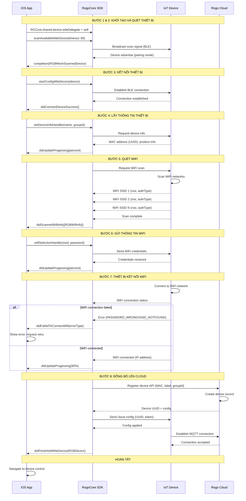
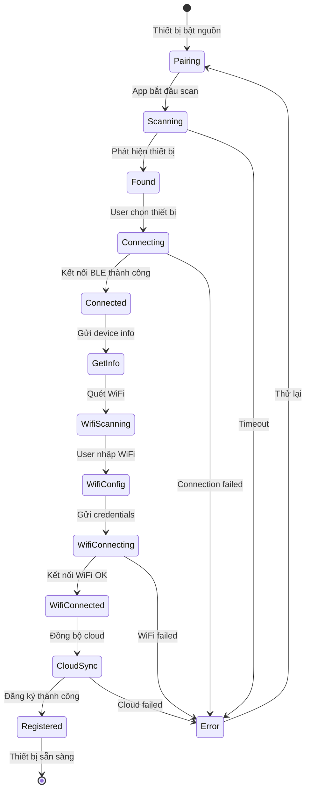
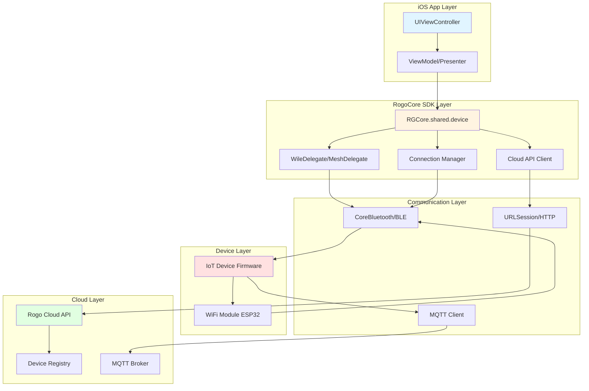

# Rogo Smart SDK - iOS

## Hướng dẫn Flow thêm thiết bị mới vào tài khoản

Tài liệu này mô tả quy trình chi tiết để thêm một thiết bị mới vào tài khoản người dùng thông qua Rogo Mobile SDK.

## Lưu ý trước khi thực hiện
- Đảm bảo đã import framework RogoCore vào project
- Đảm bảo đã khởi tạo SDK với thông tin xác thực hợp lệ
- Thiết bị iOS phải kết nối WiFi
- Thiết bị IoT cần thêm phải ở chế độ pairing/config

## Sơ đồ tổng quan

### Sơ đồ luồng giao tiếp



### Sơ đồ trạng thái thiết bị



### Sơ đồ kiến trúc giao tiếp



## Quy trình thêm thiết bị

### Bước 1: Khởi tạo quá trình thêm thiết bị (Add Device)
Khởi tạo delegate để bắt đầu quá trình thêm thiết bị mới.

```swift
import RogoCore

class AddDeviceViewController: UIViewController {

    override func viewDidLoad() {
        super.viewDidLoad()

        // Khởi tạo delegate
        RGCore.shared.device.wileDelegate = self
    }
}
```

### Bước 2: Quét thiết bị khả dụng (Scan Available Devices)
Bắt đầu quét các thiết bị WiFi (Wile) đang ở chế độ pairing trong vùng lân cận.

```swift
RGCore.shared.device.scanAvailableWileDevice(
    timeout: 60,
    limitRssi: nil,
    completion: { [weak self] response, error in
        // Xử lý kết quả
    }
)
```

#### Đối số
- `timeout`: `Int` - Thời gian tối đa để quét (giây). Khuyến nghị: 60-120 giây
- `limitRssi`: `Int?` - Giới hạn cường độ tín hiệu (dBm). Ví dụ: -70. Truyền `nil` để không giới hạn
- `completion`: `RGBCompletionObject<RGBMeshScannedDevice?>?` - Closure được gọi khi tìm thấy thiết bị

#### Completion Handler
```swift
RGCore.shared.device.scanAvailableWileDevice(
    timeout: 60,
    limitRssi: -70,
    completion: { [weak self] response, error in
        guard let self = self else { return }

        if let error = error {
            // Lỗi trong quá trình quét (timeout hoặc lỗi khác)
            self.showError("Lỗi quét thiết bị: \(error.localizedDescription)")
            return
        }

        if let device = response {
            // Thiết bị được tìm thấy
            // device chứa: uuid (MAC), product?.name, rssi
            self.detectedDevice = device
            print("Tìm thấy thiết bị: \(device.product?.name ?? "")")
            print("MAC Address: \(device.uuid ?? "")")
            print("Signal: \(device.rssi) dBm")

            // Chuyển sang bước 3
            self.connectToDevice()
        } else {
            // Timeout - không tìm thấy thiết bị
            self.showError("Không tìm thấy thiết bị. Vui lòng thử lại.")
        }
    }
)
```

#### Dừng quét
```swift
// Không có API dừng quét cho Wile device
// Quá trình quét sẽ tự động dừng khi timeout hoặc tìm thấy thiết bị
```

### Bước 3: Kết nối đến thiết bị đích (Connect to Target Device)
Sau khi tìm thấy thiết bị, tiến hành kết nối và bắt đầu cấu hình.

```swift
RGCore.shared.device.wileDelegate = self
RGCore.shared.device.startConfigWileDevice(device: detectedDevice)
```

#### Đối số
- `device`: `RGBMeshScannedDevice` - Đối tượng thiết bị đã quét được từ Bước 2

#### Delegate Method - Kết nối thành công
```swift
extension AddDeviceViewController: RGBWileDelegate {

    func didConnectDeviceSuccess(setDeviceInfoHandler: ((String?, String?) -> ())?) {
        // Kết nối thành công
        // setDeviceInfoHandler: Handler để gửi thông tin thiết bị

        // Yêu cầu người dùng đặt tên thiết bị
        self.showDeviceNameInput { deviceName, groupId in
            // Gửi thông tin thiết bị đến SDK
            setDeviceInfoHandler?(deviceName, groupId)
        }

        // Hoặc gửi trực tiếp nếu đã có thông tin
        let deviceName = "Đèn phòng khách"
        let groupId = "room-uuid-123" // hoặc nil nếu chưa gán nhóm
        setDeviceInfoHandler?(deviceName, groupId)
    }
}
```

#### Tham số trong setDeviceInfoHandler
- `deviceName`: `String?` - Tên thiết bị do người dùng đặt
- `groupId`: `String?` - UUID của nhóm/phòng. Truyền `nil` nếu chưa gán nhóm

### Bước 4: Gửi tin nhắn cấu hình và lấy địa chỉ MAC (Send Config Message / Get MAC Address)
Sau khi gửi thông tin thiết bị, SDK tự động gửi cấu hình và nhận MAC address.

#### Delegate Method - Progress Update
```swift
extension AddDeviceViewController: RGBWileDelegate {

    func didUpdateProgessing(percent: Int) {
        // Nhận cập nhật tiến độ cấu hình (0-100%)
        DispatchQueue.main.async {
            self.progressBar.progress = Float(percent) / 100.0
            self.labelProgress.text = "\(percent)%"

            if percent < 30 {
                self.labelStatus.text = "Đang kết nối thiết bị..."
            } else if percent < 60 {
                self.labelStatus.text = "Đang lấy thông tin thiết bị..."
            } else if percent < 90 {
                self.labelStatus.text = "Đang cấu hình WiFi..."
            } else {
                self.labelStatus.text = "Đang đồng bộ lên Cloud..."
            }
        }
    }
}
```

#### Lưu ý
- MAC address có sẵn trong `detectedDevice.uuid` từ Bước 2
- Quá trình này được SDK xử lý tự động, không cần gọi API riêng

### Bước 5: Thiết bị trả về danh sách WiFi SSID (Device Returns WiFi List)
SDK yêu cầu thiết bị quét WiFi và trả về danh sách các mạng khả dụng.

#### Delegate Method
```swift
extension AddDeviceViewController: RGBWileDelegate {

    func didScannedWifiInfo(
        _ listWifiInfos: [RGBWifiInfo],
        wifiSelectionHandler: ((String, String) -> ())?
    ) {
        // Nhận danh sách WiFi từ thiết bị
        // listWifiInfos: Mảng chứa thông tin các WiFi
        // wifiSelectionHandler: Handler để gửi WiFi đã chọn (sử dụng ở Bước 6)

        // Lưu handler để sử dụng sau
        self.wifiSelectionHandler = wifiSelectionHandler

        // Lưu danh sách WiFi
        self.wifiList = listWifiInfos

        // Xử lý danh sách WiFi
        for wifi in listWifiInfos {
            print("SSID: \(wifi.ssid)")
            print("RSSI: \(wifi.rssi) dBm")
            print("Auth Type: \(wifi.authType)")

            // Kiểm tra WiFi có mật khẩu không
            if wifi.authType == .WIFI_AUTH_OPEN {
                print("-> WiFi không có mật khẩu")
            }
        }

        // Hiển thị UI cho người dùng chọn WiFi
        DispatchQueue.main.async {
            self.showWifiSelectionScreen(wifiList: listWifiInfos)
        }
    }
}
```

#### RGBWifiInfo Structure
```swift
class RGBWifiInfo {
    var ssid: String        // Tên mạng WiFi
    var rssi: Int          // Cường độ tín hiệu (-100 đến 0 dBm)
    var authType: RGBWifiAuthType  // Loại bảo mật
}

// Các loại bảo mật
enum RGBWifiAuthType: Int {
    case WIFI_AUTH_OPEN = 0           // Không mật khẩu
    case WIFI_AUTH_WEP = 1            // WEP (không khuyến nghị)
    case WIFI_AUTH_WPA_PSK = 2        // WPA
    case WIFI_AUTH_WPA2_PSK = 3       // WPA2
    case WIFI_AUTH_WPA_WPA2_PSK = 4   // WPA/WPA2 hỗn hợp
    case WIFI_AUTH_WPA2_ENTERPRISE = 5 // WPA2 Enterprise
    case WIFI_AUTH_WPA3_PSK = 6       // WPA3
}
```

### Bước 6: Gửi thông tin kết nối WiFi (Send WiFi Credentials)
Gửi thông tin SSID và mật khẩu để thiết bị kết nối vào mạng WiFi.

```swift
// Được gọi khi người dùng chọn WiFi và nhập mật khẩu
func userDidSelectWifi(ssid: String, password: String) {
    // Gọi handler đã lưu từ Bước 5
    self.wifiSelectionHandler?(ssid, password)
}
```

#### Ví dụ UI Implementation
```swift
@IBAction func btnConnectWifiTapped(_ sender: UIButton) {
    guard let selectedWifi = self.selectedWifi else {
        self.showAlert("Vui lòng chọn mạng WiFi")
        return
    }

    let ssid = selectedWifi.ssid
    let password = txtPassword.text ?? ""

    // Kiểm tra WiFi có cần password không
    if selectedWifi.authType == .WIFI_AUTH_OPEN {
        // WiFi không có mật khẩu, gửi chuỗi rỗng
        wifiSelectionHandler?(ssid, "")
    } else {
        // WiFi có mật khẩu
        guard !password.isEmpty else {
            self.showAlert("Vui lòng nhập mật khẩu WiFi")
            return
        }
        wifiSelectionHandler?(ssid, password)
    }

    // Hiển thị loading
    self.showLoadingIndicator("Đang kết nối WiFi...")
}
```

#### Tham số trong wifiSelectionHandler
- `ssid`: `String` - Tên mạng WiFi đã chọn
- `password`: `String` - Mật khẩu WiFi. Truyền `""` (chuỗi rỗng) cho Open WiFi

### Bước 7: Thiết bị kết nối WiFi và phản hồi (Device Connects to WiFi)
Thiết bị sẽ tự động kết nối vào WiFi và gửi phản hồi về trạng thái kết nối.

#### Delegate Method - Xử lý lỗi WiFi
```swift
extension AddDeviceViewController: RGBWileDelegate {

    func didFailedToConnectWifi(
        _ ssid: String?,
        _ password: String?,
        _ wifiConnectionState: RGBWifiConnectionErrorType
    ) {
        // Thiết bị không thể kết nối WiFi

        DispatchQueue.main.async {
            self.hideLoadingIndicator()

            var errorMessage = ""
            var shouldRetry = true

            switch wifiConnectionState {
            case .PASSWORD_WRONG:
                // Mật khẩu WiFi sai
                errorMessage = "Mật khẩu WiFi không đúng. Vui lòng thử lại."

            case .SSID_NOTFOUND:
                // Không tìm thấy SSID
                errorMessage = "Không tìm thấy WiFi '\(ssid ?? "")'. Đảm bảo WiFi đang hoạt động."

            case .SOMETHING_WENT_WRONG:
                // Lỗi khác
                errorMessage = "Không thể kết nối WiFi. Vui lòng thử lại."

            @unknown default:
                errorMessage = "Lỗi không xác định khi kết nối WiFi."
            }

            // Hiển thị lỗi và cho phép thử lại
            self.showErrorAlert(errorMessage) {
                // Quay lại màn hình chọn WiFi để thử lại
                self.showWifiSelectionScreen(wifiList: self.wifiList)
            }
        }
    }
}
```

#### Error Types
```swift
enum RGBWifiConnectionErrorType: Int {
    case PASSWORD_WRONG = 0         // Mật khẩu sai
    case SSID_NOTFOUND = 1         // Không tìm thấy SSID
    case SOMETHING_WENT_WRONG = 2  // Lỗi khác
}
```

#### Lưu ý
- Nếu kết nối WiFi thành công, không có delegate method riêng
- Quá trình sẽ tự động chuyển sang Bước 8 (đồng bộ Cloud)
- `didUpdateProgessing(percent:)` sẽ được gọi với giá trị cao hơn (70-90%)

### Bước 8: Hoàn tất cấu hình và đồng bộ lên Cloud (Complete Setup & Sync to Cloud)
Sau khi thiết bị kết nối WiFi thành công, SDK tự động đồng bộ thiết bị lên Cloud.

#### Delegate Method - Hoàn thành
```swift
extension AddDeviceViewController: RGBWileDelegate {

    func didFinishAddWileDevice(response: RGBDevice?, error: Error?) {
        DispatchQueue.main.async {
            self.hideLoadingIndicator()

            if let error = error {
                // Lỗi khi đồng bộ lên Cloud
                self.showErrorAlert("Lỗi đồng bộ thiết bị: \(error.localizedDescription)")
                return
            }

            guard let device = response else {
                self.showErrorAlert("Không nhận được thông tin thiết bị từ Cloud")
                return
            }

            // ✅ Thành công - Thiết bị đã được thêm và đồng bộ lên Cloud
            print("✅ Thiết bị đã được thêm thành công!")
            print("Device UUID: \(device.uuid ?? "")")
            print("Device Label: \(device.label ?? "")")
            print("Device Type: \(device.product?.name ?? "")")
            print("Group ID: \(device.groupId ?? "")")
            print("Online Status: \(device.online)")

            // Hiển thị thông báo thành công
            self.showSuccessAlert("Thiết bị '\(device.label ?? "")' đã được thêm thành công!") {
                // Quay về màn hình danh sách thiết bị
                self.navigationController?.popViewController(animated: true)

                // Hoặc chuyển sang màn hình điều khiển thiết bị
                // self.navigateToDeviceControl(device: device)

                // Gửi thông báo để reload danh sách thiết bị
                NotificationCenter.default.post(
                    name: NSNotification.Name("DeviceAdded"),
                    object: device
                )
            }
        }
    }
}
```

#### RGBDevice Structure
```swift
class RGBDevice {
    var uuid: String?           // Device ID/UUID (từ Cloud)
    var label: String?          // Tên thiết bị
    var groupId: String?        // ID nhóm/phòng
    var product: RGBProduct?    // Thông tin sản phẩm (name, type, icon)
    var online: Bool            // Trạng thái online/offline
    var data: [String: Any]?    // Dữ liệu trạng thái thiết bị (on/off, brightness, etc.)
    var firmware: String?       // Phiên bản firmware
}
```

## Hủy bỏ quá trình thêm thiết bị

Bất kỳ lúc nào trong quá trình thêm thiết bị, có thể hủy bỏ bằng cách:

```swift
RGCore.shared.device.cancelWileConfig()
```

#### Ví dụ
```swift
@IBAction func btnCancelTapped(_ sender: UIButton) {
    // Hủy quá trình cấu hình
    RGCore.shared.device.cancelWileConfig()

    // Quay lại màn hình trước
    self.navigationController?.popViewController(animated: true)
}

override func viewWillDisappear(_ animated: Bool) {
    super.viewWillDisappear(animated)

    // Tự động hủy nếu user thoát màn hình
    if self.isMovingFromParent {
        RGCore.shared.device.cancelWileConfig()
    }
}
```

## Xử lý lỗi

### Các mã lỗi thường gặp

| Lỗi | Nguyên nhân | Giải pháp |
|-----|-------------|-----------|
| Timeout khi scan | Thiết bị quá xa hoặc không ở chế độ pairing | Di chuyển gần thiết bị, reset thiết bị về chế độ pairing |
| Connection failed | Thiết bị đã kết nối tài khoản khác | Reset thiết bị về factory settings |
| PASSWORD_WRONG | Mật khẩu WiFi không đúng | Kiểm tra lại mật khẩu, đảm bảo đúng chữ hoa/thường |
| SSID_NOTFOUND | WiFi đã tắt hoặc ngoài tầm | Bật WiFi router, di chuyển thiết bị gần router hơn |
| SOMETHING_WENT_WRONG | Lỗi kết nối WiFi khác | Thử lại, kiểm tra cường độ tín hiệu WiFi |
| Cloud sync failed | Không có kết nối internet | Kiểm tra kết nối internet của điện thoại |
| Device offline sau khi add | WiFi mất kết nối | Kiểm tra thiết bị có kết nối WiFi không, reboot thiết bị |

### Ví dụ xử lý lỗi

```swift
func showError(for error: Error) {
    let errorMessage: String
    let nsError = error as NSError

    // Xử lý theo mã lỗi nếu có
    switch nsError.code {
    case 1001:
        errorMessage = "Không tìm thấy thiết bị. Vui lòng kiểm tra thiết bị đã ở chế độ pairing."

    case 1002:
        errorMessage = "Không thể kết nối đến thiết bị. Vui lòng đưa điện thoại gần thiết bị hơn."

    case 1006:
        errorMessage = "Không thể kết nối đến server. Vui lòng kiểm tra kết nối internet."

    default:
        errorMessage = error.localizedDescription
    }

    DispatchQueue.main.async {
        self.showAlert(errorMessage)
    }
}

func handleWifiError(_ errorType: RGBWifiConnectionErrorType, ssid: String?, password: String?) {
    var shouldShowPasswordInput = false
    var errorMessage = ""

    switch errorType {
    case .PASSWORD_WRONG:
        errorMessage = "Mật khẩu WiFi không đúng"
        shouldShowPasswordInput = true

    case .SSID_NOTFOUND:
        errorMessage = "Không tìm thấy WiFi '\(ssid ?? "")'. Hãy đảm bảo router WiFi đang hoạt động."

    case .SOMETHING_WENT_WRONG:
        errorMessage = "Lỗi kết nối WiFi. Vui lòng thử lại."

    @unknown default:
        errorMessage = "Lỗi không xác định"
    }

    if shouldShowPasswordInput {
        // Cho phép nhập lại password
        self.showWifiPasswordInput(ssid: ssid ?? "", errorMessage: errorMessage)
    } else {
        // Hiển thị lỗi và quay lại chọn WiFi
        self.showErrorAlert(errorMessage) {
            self.showWifiSelectionScreen(wifiList: self.wifiList)
        }
    }
}
```

## Ví dụ Flow hoàn chỉnh

```swift
import UIKit
import RogoCore

class AddDeviceViewController: UIViewController {

    // MARK: - Properties
    @IBOutlet weak var progressBar: UIProgressView!
    @IBOutlet weak var labelProgress: UILabel!
    @IBOutlet weak var labelStatus: UILabel!

    private var detectedDevice: RGBMeshScannedDevice?
    private var wifiList: [RGBWifiInfo] = []
    private var wifiSelectionHandler: ((String, String) -> ())?
    private var selectedWifi: RGBWifiInfo?

    // MARK: - Lifecycle
    override func viewDidLoad() {
        super.viewDidLoad()

        // Bước 1: Khởi tạo delegate
        RGCore.shared.device.wileDelegate = self

        // Bắt đầu quá trình thêm thiết bị
        startAddDevice()
    }

    override func viewWillDisappear(_ animated: Bool) {
        super.viewWillDisappear(animated)

        // Hủy quá trình nếu user thoát màn hình
        if self.isMovingFromParent {
            RGCore.shared.device.cancelWileConfig()
        }
    }

    // MARK: - Bước 1 & 2: Khởi tạo và Quét thiết bị
    func startAddDevice() {
        showLoadingIndicator("Đang quét thiết bị...")

        RGCore.shared.device.scanAvailableWileDevice(
            timeout: 60,
            limitRssi: -70,
            completion: { [weak self] response, error in
                guard let self = self else { return }

                DispatchQueue.main.async {
                    self.hideLoadingIndicator()

                    if let error = error {
                        self.showErrorAlert("Lỗi quét thiết bị: \(error.localizedDescription)")
                        return
                    }

                    if let device = response {
                        // Tìm thấy thiết bị
                        self.detectedDevice = device
                        self.connectToDevice()
                    } else {
                        // Timeout
                        self.showRetryAlert("Không tìm thấy thiết bị. Bạn có muốn thử lại?")
                    }
                }
            }
        )
    }

    // MARK: - Bước 3: Kết nối thiết bị
    private func connectToDevice() {
        guard let device = detectedDevice else { return }

        showLoadingIndicator("Đang kết nối thiết bị...")

        // Bắt đầu cấu hình thiết bị
        // Delegate methods sẽ được gọi tự động
        RGCore.shared.device.startConfigWileDevice(device: device)
    }

    // MARK: - UI Helpers
    private func showDeviceNameInput(completion: @escaping (String, String?) -> Void) {
        let alert = UIAlertController(
            title: "Đặt tên thiết bị",
            message: "Nhập tên cho thiết bị của bạn",
            preferredStyle: .alert
        )

        alert.addTextField { textField in
            textField.placeholder = "Ví dụ: Đèn phòng khách"
        }

        alert.addAction(UIAlertAction(title: "Hủy", style: .cancel))
        alert.addAction(UIAlertAction(title: "Tiếp tục", style: .default) { _ in
            let deviceName = alert.textFields?[0].text ?? "Thiết bị mới"
            let groupId: String? = nil // Có thể cho user chọn nhóm ở đây
            completion(deviceName, groupId)
        })

        present(alert, animated: true)
    }

    private func showWifiSelectionScreen(wifiList: [RGBWifiInfo]) {
        // Implement UI hiển thị danh sách WiFi
        // Có thể dùng UITableView hoặc UICollectionView
        // Khi user chọn WiFi, gọi showWifiPasswordInput
    }

    private func showWifiPasswordInput(ssid: String, errorMessage: String? = nil) {
        let alert = UIAlertController(
            title: "Kết nối WiFi",
            message: errorMessage ?? "Nhập mật khẩu cho WiFi: \(ssid)",
            preferredStyle: .alert
        )

        alert.addTextField { textField in
            textField.placeholder = "Mật khẩu WiFi"
            textField.isSecureTextEntry = true
        }

        alert.addAction(UIAlertAction(title: "Hủy", style: .cancel))
        alert.addAction(UIAlertAction(title: "Kết nối", style: .default) { [weak self] _ in
            let password = alert.textFields?[0].text ?? ""
            self?.wifiSelectionHandler?(ssid, password)
            self?.showLoadingIndicator("Đang kết nối WiFi...")
        })

        present(alert, animated: true)
    }

    private func showLoadingIndicator(_ message: String) {
        // Implement loading UI
        labelStatus.text = message
        progressBar.isHidden = false
    }

    private func hideLoadingIndicator() {
        // Hide loading UI
        progressBar.isHidden = true
    }

    private func showAlert(_ message: String) {
        let alert = UIAlertController(title: "Thông báo", message: message, preferredStyle: .alert)
        alert.addAction(UIAlertAction(title: "OK", style: .default))
        present(alert, animated: true)
    }

    private func showErrorAlert(_ message: String, retryHandler: (() -> Void)? = nil) {
        let alert = UIAlertController(title: "Lỗi", message: message, preferredStyle: .alert)

        if let retry = retryHandler {
            alert.addAction(UIAlertAction(title: "Thử lại", style: .default) { _ in
                retry()
            })
        }

        alert.addAction(UIAlertAction(title: "Đóng", style: .cancel))
        present(alert, animated: true)
    }

    private func showSuccessAlert(_ message: String, completion: @escaping () -> Void) {
        let alert = UIAlertController(title: "Thành công", message: message, preferredStyle: .alert)
        alert.addAction(UIAlertAction(title: "OK", style: .default) { _ in
            completion()
        })
        present(alert, animated: true)
    }

    private func showRetryAlert(_ message: String) {
        let alert = UIAlertController(title: "Thông báo", message: message, preferredStyle: .alert)
        alert.addAction(UIAlertAction(title: "Không", style: .cancel))
        alert.addAction(UIAlertAction(title: "Thử lại", style: .default) { [weak self] _ in
            self?.startAddDevice()
        })
        present(alert, animated: true)
    }
}

// MARK: - RGBWileDelegate
extension AddDeviceViewController: RGBWileDelegate {

    // Bước 3: Kết nối thành công
    func didConnectDeviceSuccess(setDeviceInfoHandler: ((String?, String?) -> ())?) {
        DispatchQueue.main.async {
            self.hideLoadingIndicator()

            // Yêu cầu người dùng đặt tên thiết bị
            self.showDeviceNameInput { deviceName, groupId in
                // Gửi thông tin thiết bị
                setDeviceInfoHandler?(deviceName, groupId)

                // Hiển thị progress
                self.showLoadingIndicator("Đang cấu hình thiết bị...")
            }
        }
    }

    // Bước 4: Cập nhật tiến độ
    func didUpdateProgessing(percent: Int) {
        DispatchQueue.main.async {
            self.progressBar.progress = Float(percent) / 100.0
            self.labelProgress.text = "\(percent)%"

            // Cập nhật status message theo progress
            if percent < 30 {
                self.labelStatus.text = "Đang kết nối thiết bị..."
            } else if percent < 60 {
                self.labelStatus.text = "Đang lấy thông tin thiết bị..."
            } else if percent < 90 {
                self.labelStatus.text = "Đang cấu hình WiFi..."
            } else {
                self.labelStatus.text = "Đang đồng bộ lên Cloud..."
            }
        }
    }

    // Bước 5: Nhận danh sách WiFi
    func didScannedWifiInfo(
        _ listWifiInfos: [RGBWifiInfo],
        wifiSelectionHandler: ((String, String) -> ())?
    ) {
        // Lưu handler để sử dụng ở Bước 6
        self.wifiSelectionHandler = wifiSelectionHandler
        self.wifiList = listWifiInfos

        DispatchQueue.main.async {
            self.hideLoadingIndicator()

            // Hiển thị danh sách WiFi cho user chọn
            self.showWifiSelectionScreen(wifiList: listWifiInfos)
        }
    }

    // Bước 7: Xử lý lỗi kết nối WiFi
    func didFailedToConnectWifi(
        _ ssid: String?,
        _ password: String?,
        _ wifiConnectionState: RGBWifiConnectionErrorType
    ) {
        DispatchQueue.main.async {
            self.hideLoadingIndicator()

            var errorMessage = ""

            switch wifiConnectionState {
            case .PASSWORD_WRONG:
                errorMessage = "Mật khẩu WiFi không đúng"
                // Cho phép nhập lại password
                self.showWifiPasswordInput(ssid: ssid ?? "", errorMessage: errorMessage)
                return

            case .SSID_NOTFOUND:
                errorMessage = "Không tìm thấy WiFi '\(ssid ?? "")'"

            case .SOMETHING_WENT_WRONG:
                errorMessage = "Lỗi kết nối WiFi"

            @unknown default:
                errorMessage = "Lỗi không xác định"
            }

            self.showErrorAlert(errorMessage) {
                // Quay lại chọn WiFi
                self.showWifiSelectionScreen(wifiList: self.wifiList)
            }
        }
    }

    // Bước 8: Hoàn thành
    func didFinishAddWileDevice(response: RGBDevice?, error: Error?) {
        DispatchQueue.main.async {
            self.hideLoadingIndicator()

            if let error = error {
                self.showErrorAlert("Lỗi đồng bộ thiết bị: \(error.localizedDescription)")
                return
            }

            guard let device = response else {
                self.showErrorAlert("Không nhận được thông tin thiết bị")
                return
            }

            // ✅ Thành công!
            self.showSuccessAlert("Thiết bị '\(device.label ?? "")' đã được thêm thành công!") {
                // Quay về màn hình trước
                self.navigationController?.popViewController(animated: true)

                // Gửi notification
                NotificationCenter.default.post(
                    name: NSNotification.Name("DeviceAdded"),
                    object: device
                )
            }
        }
    }
}
```

## Lưu ý quan trọng

1. **Delegate Pattern**: Luôn set `wileDelegate` trước khi gọi `startConfigWileDevice()`. Nếu không set delegate, sẽ không nhận được callbacks.

2. **Thread Safety**: Tất cả delegate methods có thể được gọi từ background thread. Luôn dùng `DispatchQueue.main.async` khi cập nhật UI.

3. **Memory Management**: Sử dụng `[weak self]` trong closures để tránh retain cycle. Nhớ set delegate về `nil` khi không dùng nữa.

4. **Cancel Config**: Luôn gọi `cancelWileConfig()` trong `viewWillDisappear` hoặc `deinit` để cleanup resources.

5. **Timeout Handling**: Mỗi bước có timeout riêng. Cần xử lý trường hợp timeout và cho phép user retry.

6. **WiFi Password**: Với Open WiFi (không mật khẩu), truyền chuỗi rỗng `""` cho password, không truyền `nil`.

7. **RSSI Limit**: Nên set `limitRssi` khoảng -70 đến -80 để chỉ quét thiết bị đủ gần, tránh quét thiết bị quá xa dẫn đến kết nối không ổn định.

8. **Error Handling**: Luôn xử lý đầy đủ các trường hợp lỗi và hiển thị thông báo rõ ràng cho user. Cung cấp option retry khi có lỗi.

9. **Progress Updates**: Sử dụng `didUpdateProgessing(percent:)` để hiển thị progress bar và status message, giúp user biết quá trình đang diễn ra.

10. **Device Info**: MAC address có sẵn trong `detectedDevice.uuid` ngay từ bước scan, không cần gọi API riêng để lấy.

## Tài liệu tham khảo

- [Cấu hình thiết bị WiFi (Wile)](../DocSDK-IOS/AddWile.md)
- [Thay đổi WiFi cho thiết bị](../DocSDK-IOS/ChangeWifi.md)
- [Cấu hình thiết bị BLE](../DocSDK-IOS/AddDeviceBLE.md)
- [Điều khiển thiết bị qua BLE](../DocSDK-IOS/ControlDeviceWifiByViaBLE.md)
- [Khởi tạo SDK](./SDK_Start.md)
- [Xác thực người dùng](./Authenticate.md)
