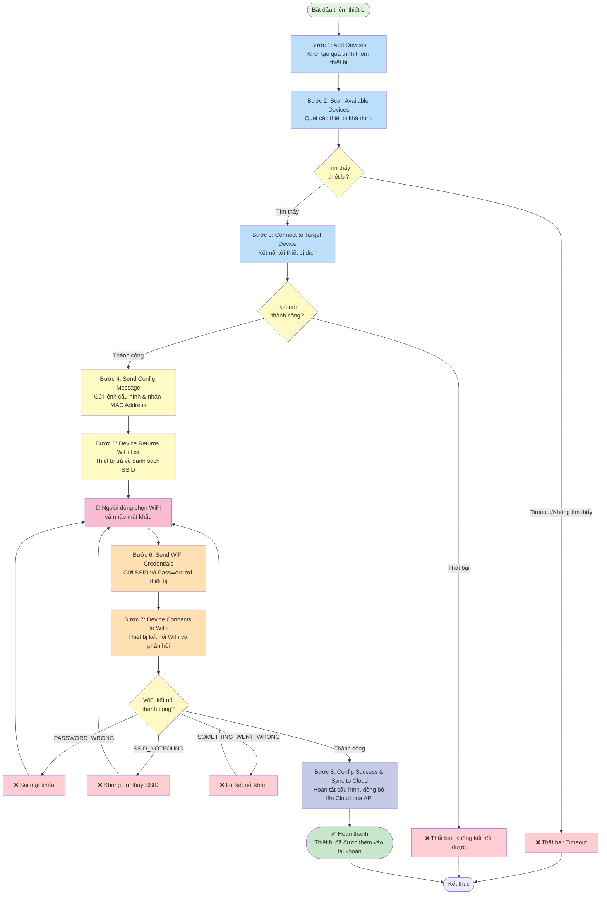
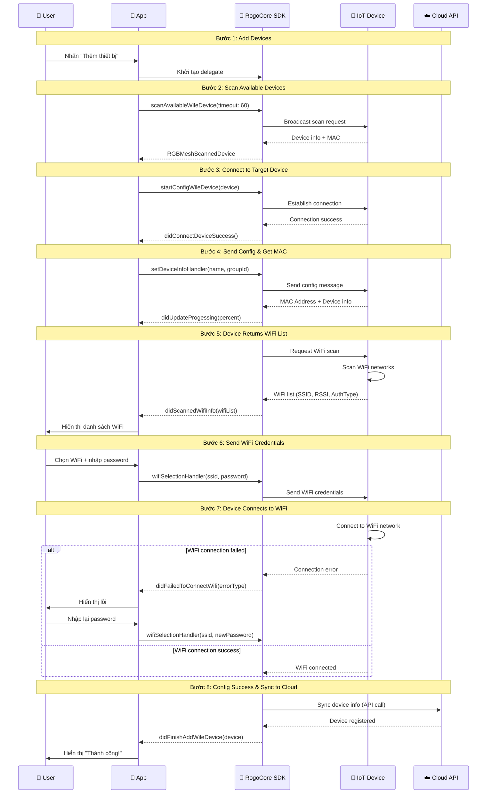

# Flow Thêm Thiết Bị Mới Vào Tài Khoản
## Device Onboarding Flow - Rogo Core Sample Mobile SDK

### Tổng quan
Flow này mô tả quy trình hoàn chỉnh để thêm một thiết bị mới vào tài khoản người dùng, bao gồm quét thiết bị, kết nối, cấu hình WiFi và đồng bộ lên cloud.

---

## Flow Diagram



---

## Chi tiết từng bước

### **Bước 1: Add Devices - Khởi tạo quá trình thêm thiết bị**

**Mô tả:**
- Người dùng bắt đầu quy trình thêm thiết bị mới
- Chuẩn bị môi trường và khởi tạo các handler cần thiết

**API sử dụng:**
```swift
// Import RogoCore SDK
import RogoCore

// Khởi tạo delegate để xử lý các sự kiện
RGCore.shared.device.wileDelegate = self
```

**Lưu ý:**
- Đảm bảo SDK đã được khởi tạo và user đã đăng nhập
- Class phải conform protocol `RGBWileDelegate`

---

### **Bước 2: Scan Available Devices - Quét các thiết bị khả dụng**

**Mô tả:**
- Quét các thiết bị WiFi (Wile) khả dụng trong vùng lân cận
- Giới hạn thời gian quét (timeout) để tránh chờ vô thời hạn
- Có thể giới hạn theo cường độ tín hiệu (RSSI)

**API sử dụng:**
```swift
RGCore.shared.device.scanAvailableWileDevice(
    timeout: 60,              // Thời gian timeout (giây)
    limitRssi: -70,           // Giới hạn RSSI (nil = không giới hạn)
    completion: { response, error in
        if let device = response {
            // Tìm thấy thiết bị
            print("Device found: \(device.product?.name ?? "")")
            print("Device MAC: \(device.uuid ?? "")")
            self.detectedDevice = device
            // Chuyển sang bước 3
        } else {
            // Timeout hoặc lỗi
            print("Scan failed: \(error?.localizedDescription ?? "")")
        }
    }
)
```

**Tham số:**
- `timeout`: Thời gian tối đa để quét (tính bằng giây)
- `limitRssi`: Giới hạn cường độ tín hiệu (số âm, càng nhỏ càng mạnh). Ví dụ: -70
- `completion`: Callback trả về thiết bị tìm thấy hoặc lỗi

**Response:**
- `RGBMeshScannedDevice`: Thông tin thiết bị được tìm thấy
  - `uuid`: MAC Address của thiết bị
  - `product.name`: Tên sản phẩm
  - `rssi`: Cường độ tín hiệu

---

### **Bước 3: Connect to Target Device - Kết nối tới thiết bị đích**

**Mô tả:**
- Bắt đầu quá trình kết nối và cấu hình thiết bị đã quét được
- Thiết lập kênh giao tiếp với thiết bị

**API sử dụng:**
```swift
RGCore.shared.device.wileDelegate = self
RGCore.shared.device.startConfigWileDevice(device: detectedDevice)
```

**Hoặc sử dụng closure-based approach:**
```swift
RGCore.shared.device.startConfigWileDevice(
    device: detectedDevice,
    didUpdateProgessing: { percent in
        // Cập nhật progress bar
        print("Progress: \(percent)%")
    },
    wifiScanCompletedHandler: { wifiList in
        // Xử lý ở bước 5
    },
    wifiSelectionHandler: { ssid, password in
        // Xử lý ở bước 6
    },
    wifiConnectErrorHandler: { ssid, password, errorType in
        // Xử lý lỗi ở bước 7
    },
    didCompletedHandler: { device in
        // Xử lý ở bước 8
    }
)
```

**Delegate Method:**
```swift
// RGBWileDelegate - được gọi khi kết nối thành công
func didConnectDeviceSuccess(setDeviceInfoHandler: ((String?, String?) -> ())?) {
    // Gửi thông tin thiết bị
    let deviceName = "My Smart Device"
    let groupId = "room-uuid-123"
    setDeviceInfoHandler?(deviceName, groupId)
}
```

**Tham số trong setDeviceInfoHandler:**
- `deviceName`: Tên thiết bị do người dùng đặt
- `groupId`: UUID của nhóm/phòng muốn thêm thiết bị vào

---

### **Bước 4: Send Config Message & Get MAC Address**

**Mô tả:**
- SDK tự động gửi các lệnh cấu hình tới thiết bị
- Nhận thông tin MAC Address và thông tin thiết bị
- Quá trình này được xử lý tự động bởi SDK

**Delegate Method:**
```swift
func didUpdateProgessing(percent: Int) {
    // Hiển thị tiến trình cấu hình
    progressBar.progress = Float(percent) / 100.0
    labelProgress.text = "\(percent)%"
}
```

**Response:**
- MAC Address: Có sẵn trong `detectedDevice.uuid`
- Device Info: Có sẵn trong `detectedDevice.product`

---

### **Bước 5: Device Returns WiFi List - Thiết bị trả về danh sách SSID**

**Mô tả:**
- Thiết bị quét các mạng WiFi xung quanh
- Trả về danh sách các SSID khả dụng kèm thông tin bảo mật

**Delegate Method:**
```swift
func didScannedWifiInfo(
    _ listWifiInfos: [RGBWifiInfo],
    wifiSelectionHandler: ((String, String) -> ())?
) {
    // Lưu handler để sử dụng sau
    self.wifiSelectionHandler = wifiSelectionHandler

    // Hiển thị danh sách WiFi cho người dùng chọn
    self.wifiList = listWifiInfos

    // Ví dụ: Hiển thị trong table view
    for wifiInfo in listWifiInfos {
        print("SSID: \(wifiInfo.ssid)")
        print("RSSI: \(wifiInfo.rssi)")
        print("Auth Type: \(wifiInfo.authType)")

        // Kiểm tra WiFi có mật khẩu không
        if wifiInfo.authType == .WIFI_AUTH_OPEN {
            print("WiFi không có mật khẩu")
        }
    }

    // Hiển thị UI cho người dùng chọn WiFi
    self.showWifiSelectionUI()
}
```

**RGBWifiInfo Structure:**
```swift
class RGBWifiInfo {
    var ssid: String        // Tên WiFi
    var rssi: Int          // Cường độ tín hiệu (-100 đến 0)
    var authType: RGBWifiAuthType  // Loại bảo mật
}

// Các loại bảo mật
enum RGBWifiAuthType {
    case WIFI_AUTH_OPEN           // Không mật khẩu
    case WIFI_AUTH_WEP            // WEP
    case WIFI_AUTH_WPA_PSK        // WPA
    case WIFI_AUTH_WPA2_PSK       // WPA2
    case WIFI_AUTH_WPA_WPA2_PSK   // WPA/WPA2
    case WIFI_AUTH_WPA2_ENTERPRISE // WPA2 Enterprise
}
```

---

### **Bước 6: Send WiFi Credentials - Gửi SSID và Password**

**Mô tả:**
- Người dùng chọn WiFi và nhập mật khẩu
- App gửi thông tin WiFi tới thiết bị

**Code Implementation:**
```swift
// Được gọi khi người dùng chọn WiFi và nhập password
func userDidSelectWifi(ssid: String, password: String) {
    // Gọi handler đã lưu từ bước 5
    self.wifiSelectionHandler?(ssid, password)

    // Hoặc nếu dùng closure approach:
    // Handler đã được thiết lập trong startConfigWileDevice
}
```

**UI Example:**
```swift
@IBAction func btnConnectWifiTapped(_ sender: UIButton) {
    let selectedSSID = txtWifiName.text ?? ""
    let password = txtPassword.text ?? ""

    // Validate input
    guard !selectedSSID.isEmpty else {
        showAlert("Vui lòng chọn WiFi")
        return
    }

    // Gửi thông tin WiFi
    wifiSelectionHandler?(selectedSSID, password)
}
```

---

### **Bước 7: Device Connects to WiFi - Thiết bị kết nối và phản hồi**

**Mô tả:**
- Thiết bị nhận thông tin WiFi và thực hiện kết nối
- Trả về trạng thái kết nối (thành công hoặc lỗi)

**Delegate Method - Xử lý lỗi:**
```swift
func didFailedToConnectWifi(
    _ ssid: String?,
    _ password: String?,
    _ wifiConnectionState: RGBWifiConnectionErrorType
) {
    // Xử lý các loại lỗi
    var errorMessage = ""

    switch wifiConnectionState {
    case .PASSWORD_WRONG:
        errorMessage = "Sai mật khẩu WiFi. Vui lòng thử lại."

    case .SSID_NOTFOUND:
        errorMessage = "Không tìm thấy WiFi '\(ssid ?? "")'. Đảm bảo WiFi đang hoạt động."

    case .SOMETHING_WENT_WRONG:
        errorMessage = "Lỗi kết nối WiFi. Vui lòng thử lại."
    }

    // Hiển thị lỗi và cho phép người dùng nhập lại
    showErrorAlert(errorMessage) {
        // Quay lại bước chọn WiFi
        self.showWifiSelectionUI()
    }
}
```

**Error Types:**
```swift
enum RGBWifiConnectionErrorType {
    case PASSWORD_WRONG          // Mật khẩu sai
    case SSID_NOTFOUND          // Không tìm thấy SSID
    case SOMETHING_WENT_WRONG   // Lỗi khác
}
```

**Flow xử lý lỗi:**
- Nếu lỗi → Hiển thị thông báo → Quay lại Bước 5 (chọn WiFi lại)
- Nếu thành công → Chuyển sang Bước 8

---

### **Bước 8: Config Success & Sync to Cloud - Đồng bộ lên Cloud**

**Mô tả:**
- Thiết bị đã kết nối WiFi thành công
- SDK tự động đồng bộ thông tin thiết bị lên Cloud
- Thiết bị được thêm vào tài khoản người dùng

**Delegate Method:**
```swift
func didFinishAddWileDevice(response: RGBDevice?, error: Error?) {
    if let error = error {
        // Xử lý lỗi
        showErrorAlert("Lỗi thêm thiết bị: \(error.localizedDescription)")
        return
    }

    guard let device = response else {
        showErrorAlert("Không nhận được thông tin thiết bị")
        return
    }

    // Thành công - Thiết bị đã được thêm và đồng bộ lên cloud
    print("✅ Thiết bị đã được thêm thành công!")
    print("Device ID: \(device.uuid ?? "")")
    print("Device Name: \(device.label ?? "")")
    print("Device Type: \(device.product?.name ?? "")")
    print("Group ID: \(device.groupId ?? "")")

    // Hiển thị thông báo thành công
    showSuccessAlert("Thiết bị đã được thêm thành công!") {
        // Quay về màn hình danh sách thiết bị
        self.navigationController?.popViewController(animated: true)

        // Hoặc reload danh sách thiết bị
        NotificationCenter.default.post(
            name: NSNotification.Name("DeviceAdded"),
            object: device
        )
    }
}
```

**RGBDevice Structure:**
```swift
class RGBDevice {
    var uuid: String?           // Device ID (MAC Address)
    var label: String?          // Tên thiết bị
    var groupId: String?        // ID nhóm/phòng
    var product: RGBProduct?    // Thông tin sản phẩm
    var online: Bool            // Trạng thái online
    var data: [String: Any]?    // Dữ liệu thiết bị
}
```

**API đồng bộ:**
- SDK tự động gọi API đồng bộ lên cloud
- Không cần gọi API thủ công
- Thiết bị sẽ xuất hiện trong danh sách thiết bị của user

---

## Code Example: Flow hoàn chỉnh

```swift
import RogoCore
import UIKit

class AddDeviceViewController: UIViewController, RGBWileDelegate {

    // MARK: - Properties
    private var detectedDevice: RGBMeshScannedDevice?
    private var wifiList: [RGBWifiInfo] = []
    private var wifiSelectionHandler: ((String, String) -> ())?

    // MARK: - Bước 1 & 2: Khởi tạo và Scan
    func startAddDeviceFlow() {
        // Bước 1: Khởi tạo
        RGCore.shared.device.wileDelegate = self

        // Bước 2: Quét thiết bị
        showLoadingIndicator("Đang quét thiết bị...")

        RGCore.shared.device.scanAvailableWileDevice(
            timeout: 60,
            limitRssi: nil,
            completion: { [weak self] response, error in
                guard let self = self else { return }

                self.hideLoadingIndicator()

                if let device = response {
                    // Tìm thấy thiết bị
                    self.detectedDevice = device
                    self.connectToDevice(device)
                } else {
                    // Timeout hoặc không tìm thấy
                    self.showErrorAlert("Không tìm thấy thiết bị. Vui lòng thử lại.")
                }
            }
        )
    }

    // MARK: - Bước 3: Connect to Device
    private func connectToDevice(_ device: RGBMeshScannedDevice) {
        showLoadingIndicator("Đang kết nối thiết bị...")

        // Bắt đầu cấu hình thiết bị
        RGCore.shared.device.startConfigWileDevice(device: device)
    }

    // MARK: - RGBWileDelegate Methods

    // Bước 3: Kết nối thành công
    func didConnectDeviceSuccess(setDeviceInfoHandler: ((String?, String?) -> ())?) {
        hideLoadingIndicator()

        // Yêu cầu người dùng đặt tên thiết bị
        showDeviceNameInput { deviceName, groupId in
            setDeviceInfoHandler?(deviceName, groupId)
        }
    }

    // Bước 4: Progress update
    func didUpdateProgessing(percent: Int) {
        updateProgressBar(percent: percent)
    }

    // Bước 5: Nhận danh sách WiFi
    func didScannedWifiInfo(
        _ listWifiInfos: [RGBWifiInfo],
        wifiSelectionHandler: ((String, String) -> ())?
    ) {
        self.wifiList = listWifiInfos
        self.wifiSelectionHandler = wifiSelectionHandler

        // Hiển thị UI chọn WiFi
        showWifiSelectionScreen(wifiList: listWifiInfos)
    }

    // Bước 7: Xử lý lỗi kết nối WiFi
    func didFailedToConnectWifi(
        _ ssid: String?,
        _ password: String?,
        _ wifiConnectionState: RGBWifiConnectionErrorType
    ) {
        var errorMessage = ""

        switch wifiConnectionState {
        case .PASSWORD_WRONG:
            errorMessage = "Sai mật khẩu WiFi"
        case .SSID_NOTFOUND:
            errorMessage = "Không tìm thấy WiFi '\(ssid ?? "")'"
        case .SOMETHING_WENT_WRONG:
            errorMessage = "Lỗi kết nối WiFi"
        }

        showErrorAlert(errorMessage) { [weak self] in
            // Cho phép nhập lại
            self?.showWifiSelectionScreen(wifiList: self?.wifiList ?? [])
        }
    }

    // Bước 8: Hoàn thành
    func didFinishAddWileDevice(response: RGBDevice?, error: Error?) {
        hideLoadingIndicator()

        if let error = error {
            showErrorAlert("Lỗi: \(error.localizedDescription)")
            return
        }

        guard let device = response else {
            showErrorAlert("Không nhận được thông tin thiết bị")
            return
        }

        // ✅ Thành công!
        showSuccessAlert("Thiết bị '\(device.label ?? "")' đã được thêm thành công!") {
            self.navigationController?.popViewController(animated: true)
        }
    }

    // MARK: - Bước 6: Gửi WiFi credentials
    func userDidSelectWifi(ssid: String, password: String) {
        showLoadingIndicator("Đang kết nối WiFi...")
        wifiSelectionHandler?(ssid, password)
    }

    // MARK: - Helper Methods
    private func showLoadingIndicator(_ message: String) {
        // Implementation
    }

    private func hideLoadingIndicator() {
        // Implementation
    }

    private func updateProgressBar(percent: Int) {
        // Implementation
    }

    private func showDeviceNameInput(completion: @escaping (String, String) -> ()) {
        // Implementation
    }

    private func showWifiSelectionScreen(wifiList: [RGBWifiInfo]) {
        // Implementation
    }

    private func showErrorAlert(_ message: String, retry: (() -> ())? = nil) {
        // Implementation
    }

    private func showSuccessAlert(_ message: String, completion: (() -> ())? = nil) {
        // Implementation
    }
}
```

---

## Xử lý các trường hợp đặc biệt

### 1. **Hủy quá trình cấu hình**
```swift
// Người dùng có thể hủy bất cứ lúc nào
RGCore.shared.device.cancelWileConfig()
```

### 2. **WiFi không có mật khẩu (Open WiFi)**
```swift
func didScannedWifiInfo(
    _ listWifiInfos: [RGBWifiInfo],
    wifiSelectionHandler: ((String, String) -> ())?
) {
    for wifi in listWifiInfos {
        if wifi.authType == .WIFI_AUTH_OPEN {
            // WiFi không cần password, gửi chuỗi rỗng
            wifiSelectionHandler?(wifi.ssid, "")
        }
    }
}
```

### 3. **Retry khi quét không thấy thiết bị**
```swift
private var retryCount = 0
private let maxRetries = 3

func startAddDeviceFlow() {
    RGCore.shared.device.scanAvailableWileDevice(
        timeout: 60,
        limitRssi: nil,
        completion: { [weak self] response, error in
            if response == nil && self?.retryCount ?? 0 < self?.maxRetries ?? 0 {
                self?.retryCount += 1
                self?.showRetryAlert()
            }
        }
    )
}
```

---

## Sequence Diagram



---

## Troubleshooting

### Lỗi thường gặp:

| Lỗi | Nguyên nhân | Giải pháp |
|-----|-------------|-----------|
| Timeout khi scan | Thiết bị quá xa hoặc đã kết nối | Di chuyển gần thiết bị, reset thiết bị |
| PASSWORD_WRONG | Mật khẩu WiFi sai | Kiểm tra lại mật khẩu, đảm bảo đúng chữ hoa/thường |
| SSID_NOTFOUND | WiFi đã tắt hoặc ngoài tầm | Bật WiFi router, di chuyển gần router |
| Connection failed | Thiết bị đã kết nối tài khoản khác | Reset thiết bị về factory |
| Device offline sau khi add | WiFi mất kết nối | Kiểm tra kết nối internet của router |

---

## Tài liệu tham khảo

- [AddWile.md](../DocSDK-IOS/AddWile.md) - Chi tiết API thêm thiết bị WiFi
- [ChangeWifi.md](../DocSDK-IOS/ChangeWifi.md) - Thay đổi WiFi cho thiết bị đã thêm
- [ControlDeviceWifiByViaBLE.md](../DocSDK-IOS/ControlDeviceWifiByViaBLE.md) - Điều khiển qua BLE

---

## Notes

- Flow này áp dụng cho thiết bị WiFi (Wile Device)
- Đối với thiết bị BLE, xem [AddDeviceBLE.md](../DocSDK-IOS/AddDeviceBLE.md)
- Đối với thiết bị Zigbee, xem [AddDeviceZigbee.md](../DocSDK-IOS/AddDeviceZigbee.md)
- Thời gian timeout nên để 60-120 giây để đảm bảo quét đủ thiết bị
- RSSI limit -70 đến -80 là phù hợp cho hầu hết trường hợp
- Luôn xử lý trường hợp WiFi không có mật khẩu (Open WiFi)

---

**Phiên bản:** 1.0
**Ngày cập nhật:** 2025-11-13
**Tác giả:** Rogo IoT Team
